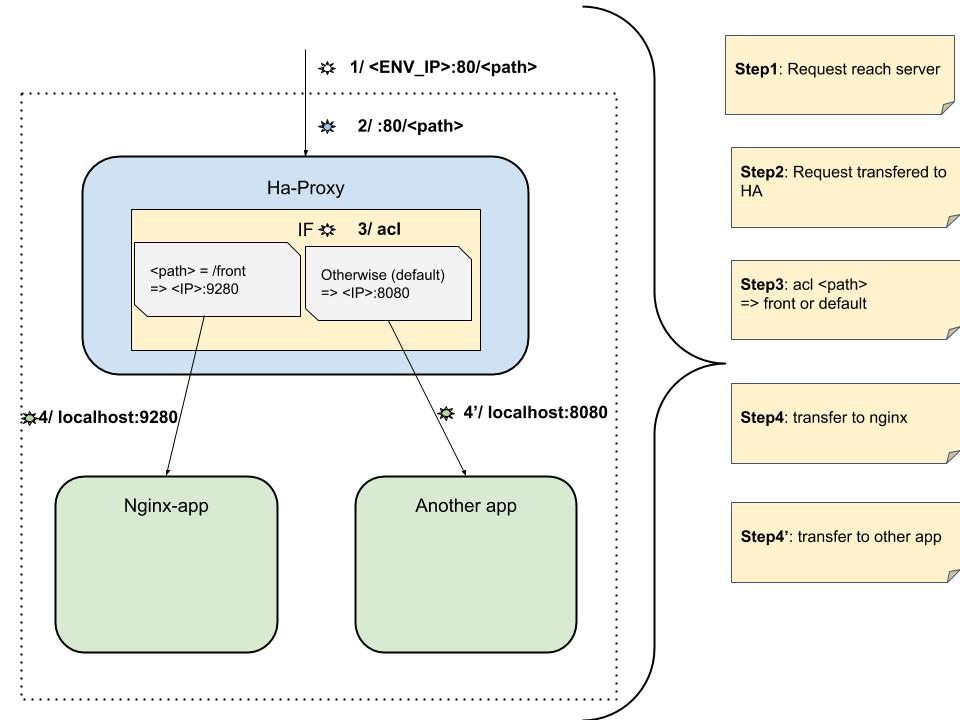

# Current architecture

# Issue

1. Browser ----   "http://ENV_URL/front"            ----> Ha Proxy
2. Ha Proxy ---- "[ACL front], rm /front from path" ----> nginx
3. Nginx ----> page ? (index.html?) ---> Ha -----> Browser
4. Browser ask for css/js in "http://ENV_URL/main.3989c63f9d314905ffc0.bundle.js"
5. Ha does not trigger front ACL, static asked to anotherApp :'(
